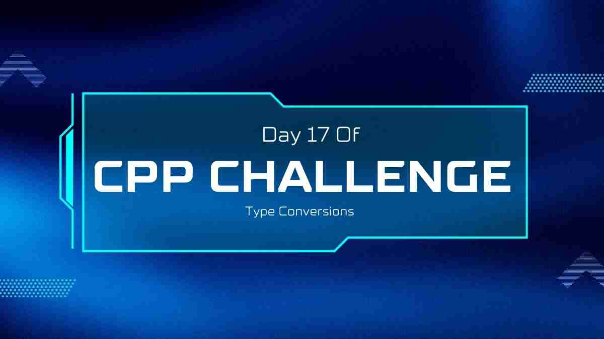
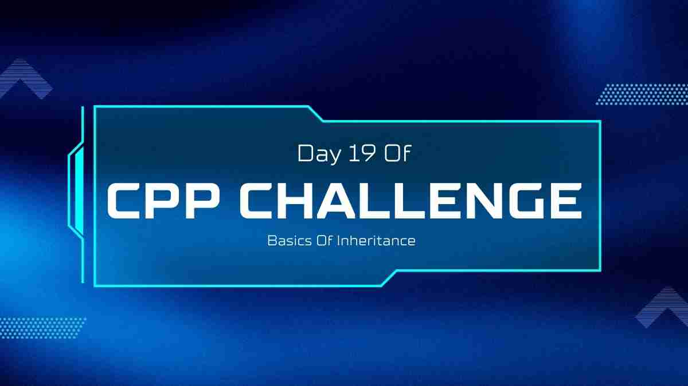
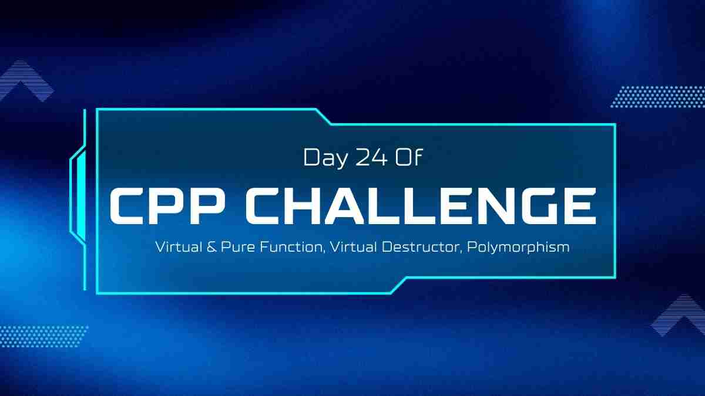
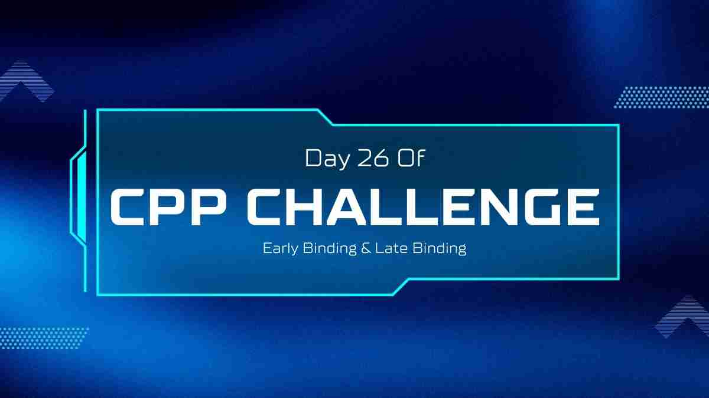

<div align="center">
<div id="top">

# <p>30 Days of C++ Challenge
</p>

<i><p> Welcome to my **30 Days of C++** repository! This is a challenge where I will post daily C++ coding problems, solutions, and important topics related to C++. The goal is to enhance my skills in C++ and document the learning process.</p></i>

</div>


<table align="center">
    <thead align="center">
        <tr border: 1px;>
            <td><b> Stars</b></td>
            <td><b>🍴 Forks</b></td>
            <td><b> Issues</b></td>
            <td><b> Open PRs</b></td>
            <td><b> Closed PRs</b></td>
        </tr>
     </thead>
    <tbody>
         <tr>
            <td></td>
             <td></td>
            <td></td>
            <td></td>
           <td></td>
        </tr>
    </tbody>
</table>

## Table of Contents


|     Let's      |  Get Started           |
|----------------|-------------------------------|
| [](https://github.com/Bhanu-partap-13/45-Days-Of-C-/tree/main/Day01)| [](https://github.com/Bhanu-partap-13/45-Days-Of-C-/tree/main/Day02) | 
| [](https://github.com/Bhanu-partap-13/45-Days-Of-C-/tree/main/Day03)| [](https://github.com/Bhanu-partap-13/45-Days-Of-C-/tree/main/Day04) | 
| [](https://github.com/Bhanu-partap-13/45-Days-Of-C-/tree/main/Day05)| [](https://github.com/Bhanu-partap-13/45-Days-Of-C-/tree/main/Day06) | 
| [](https://github.com/Bhanu-partap-13/45-Days-Of-C-/tree/main/Day07)| [](https://github.com/Bhanu-partap-13/45-Days-Of-C-/tree/main/Day08) | 
| [](https://github.com/Bhanu-partap-13/45-Days-Of-C-/tree/main/Day09)| [](https://github.com/Bhanu-partap-13/45-Days-Of-C-/tree/main/Day10) | 
| [](https://github.com/Bhanu-partap-13/45-Days-Of-C-/tree/main/Day11)| [](https://github.com/Bhanu-partap-13/45-Days-Of-C-/tree/main/Day12) | 
| [](https://github.com/Bhanu-partap-13/45-Days-Of-C-/tree/main/Day13)| [](https://github.com/Bhanu-partap-13/45-Days-Of-C-/tree/main/Day14) | 
| [](https://github.com/Bhanu-partap-13/45-Days-Of-C-/tree/main/Day15)| [](https://github.com/Bhanu-partap-13/45-Days-Of-C-/tree/main/Day16) | 
| [](https://github.com/Bhanu-partap-13/45-Days-Of-C-/tree/main/Day17)| [](https://github.com/Bhanu-partap-13/45-Days-Of-C-/tree/main/Day18) | 
| [](https://github.com/Bhanu-partap-13/45-Days-Of-C-/tree/main/Day19)| [](https://github.com/Bhanu-partap-13/45-Days-Of-C-/tree/main/Day20) | 
| [](https://github.com/Bhanu-partap-13/45-Days-Of-C-/tree/main/Day21)| [](https://github.com/Bhanu-partap-13/45-Days-Of-C-/tree/main/Day22) | 
| [](https://github.com/Bhanu-partap-13/45-Days-Of-C-/tree/main/Day23)| [](https://github.com/Bhanu-partap-13/45-Days-Of-C-/tree/main/Day24) | 
| [](https://github.com/Bhanu-partap-13/45-Days-Of-C-/tree/main/Day25)| [](https://github.com/Bhanu-partap-13/45-Days-Of-C-/tree/main/Day26) | 
| [](https://github.com/Bhanu-partap-13/45-Days-Of-C-/tree/main/Day27)| [](https://github.com/Bhanu-partap-13/45-Days-Of-C-/tree/main/Day28) | 


## Requirements
Make sure you have the following installed to follow along with the challenge:

- A C++ compiler (e.g., GCC, Clang, MSVC)
- A code editor (e.g., Visual Studio Code, CLion, Code::Blocks)
- Git for version control

## About the Challenge
This challenge will help you improve your C++ skills through daily practice.A new problem or topic will be posted each day, along with a detailed explanation and solution.

## How to Participate

1. **Fork the Repository**: Click the "Fork" button at the top right of this page to create a copy of this repository on your GitHub account.
2. **Clone the Repository**: Clone the forked repository to your local machine using `git clone`.
3. **Start Coding**: Follow the daily challenges and commit your solutions.
4. **Share Your Progress**: Feel free to share your progress on social media using the hashtag #45DaysOfCPP.

### How You Can Bring this to VS Code
>[!Note]
>1. Fork the Repostiory && Make a folder with any name.
>2. Open that folder in VS Code.
>3. Open the Terminal and then git Clone.
>4. Make sure you Star and Fork the Repository.

```bash
git clone https://github.com/your-username/30-Days-Of-CPP.git
```
>[!Tip]
>1. If you want to Create a Issue, You can go on Issues -> New Issues -> Write Title & valid Description.
>2. Work on Issue that I have created for you.

```bash
git checkout -b branch-name
```
```bash
git checkout  branch-name
```
>[!Warning]
>1. Make changes when you add your new branch and move to new branch.

```bash
git add .
```
```bash
git commit -m "your changes"
```
```bash
git push origin branch-name
```

>[!Note]
>1. Go to your Github. You will se pull request by you.
>2. Explain your changes and create pull request.

## Support Me

If you find this challenge helpful, consider buying me a coffee!

[](https://www.buymeacoffee.com/bhanupartap13)

## Connect with Me

- [GitHub](https://github.com/Bhanu-partap-13)
- [LinkedIn](https://www.linkedin.com/in/bhanu-partap-a49084274/)

## Repository

Feel free to visit the repository and check out the code:

[](https://github.com/Bhanu-partap-13/45-Days-Of-C-)

## Fun GIFs


Happy Coding! 🚀✨


<br><br>

 ## <h2 style="font-size:3rem;">Our Contributors</h2>
  <h3>Thank you for contributing to our repository</h3>
<a href="https://github.com/Bhanu-partap-13/30-Days-Of-CPP/graphs/contributors">


## Stargazers

<div align='center'>

[](https://github.com/Bhanu-partap-13/30-Days-Of-CPP/stargazers)

</div>

## Forkers

<div align='center'>

[](https://github.com/Bhanu-partap-13/30-Days-Of-CPP/network/members)

</div>


# Code of Conduct
We are committed to fostering a welcoming and inclusive environment for everyone. All contributors and participants are expected to uphold the following values:

- Be respectful of different viewpoints and experiences.
- Show empathy toward others.
- Use inclusive language.

<div align="center">
    <a href="#top">
        
    </a>
</div>


<h3 style="font-size:2rem;">
If you find this project helpful, please consider giving it a star! </p>
